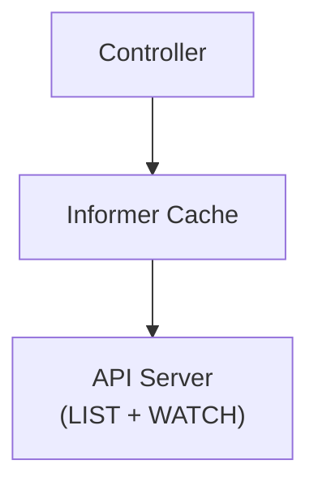

### What is an Informer?

In Kubernetes, an **Informer** is a higher-level mechanism built on top of **LIST** and **WATCH**.

Instead of directly handling API calls and events, an Informer:

- Lists existing objects
- Watches for future changes
- Stores everything in a local cache
- Notifies your code when something changes

In simple terms:

> **An Informer keeps a live, local copy of Kubernetes resources and tells you when they change.**

---

### Why Informers exist

Using LIST and WATCH directly has problems:

- Multiple components open multiple WATCH connections
- No shared state between components
- Easy to introduce race conditions
- Heavy load on the API Server

Informers solve these issues by providing:
- A shared cache
- Automatic retry and reconnection
- Ordered event processing
- Safe access to cluster state

---

### How an Informer works

At a high level, an Informer follows this flow: 

1. **LIST** – gets all existing objects
2. **WATCH** – listens for future changes
3. **Cache** – stores the latest state locally
4. **Handlers** – notifies your code about changes

---

### Informer cache

The Informer maintains an in-memory cache of objects.

This cache:
- Always reflects the latest known state
- Is updated automatically on every change
- Can be safely shared across multiple controllers

Instead of querying the API Server repeatedly, controllers read from this cache.

---

### Event handlers

Informers allow you to register handlers for object changes:

- `Add` – object created
- `Update` – object modified
- `Delete` – object removed

These handlers are meant to be **lightweight**.

Best practice:
- Do not perform heavy logic inside handlers
- Use them to signal that reconciliation is needed

---

### Informer is not a controller

This distinction is important.

- **Informer** observes and stores state
- **Controller** decides and acts on that state

Informer says:
> “This object changed.”

Controller asks:
> “What should the cluster look like now?”

This separation keeps Kubernetes stable and predictable.

---

### Shared Informers

Kubernetes uses **shared informers** to scale efficiently.

Instead of:
- One WATCH per controller

Kubernetes uses:
- One WATCH per resource
- Shared cache for many controllers

This greatly reduces API Server load and improves performance.

---

### Where Informers are used

Informers are used internally by:

- kube-controller-manager
- kube-scheduler
- kubelet
- kube-proxy
- CoreDNS
- Operators and controllers (ArgoCD, Prometheus, cert-manager)

If a component reacts to Kubernetes changes, it almost always uses an Informer.

---

### Why Informers prevent race conditions

Informers help prevent race conditions by:

- Providing a single, consistent view of cluster state
- Ensuring ordered processing of changes
- Allowing controllers to reconcile based on current state
- Treating events as signals, not commands

Even if events are duplicated or missed, controllers still converge to the correct state.

---

### Informer in Kubernetes architecture

Controllers do not continuously talk to the API Server; they rely on the Informer cache.

---

> **An Informer safely combines LIST and WATCH, maintains a local cache, and enables scalable, race-free Kubernetes controllers.**

